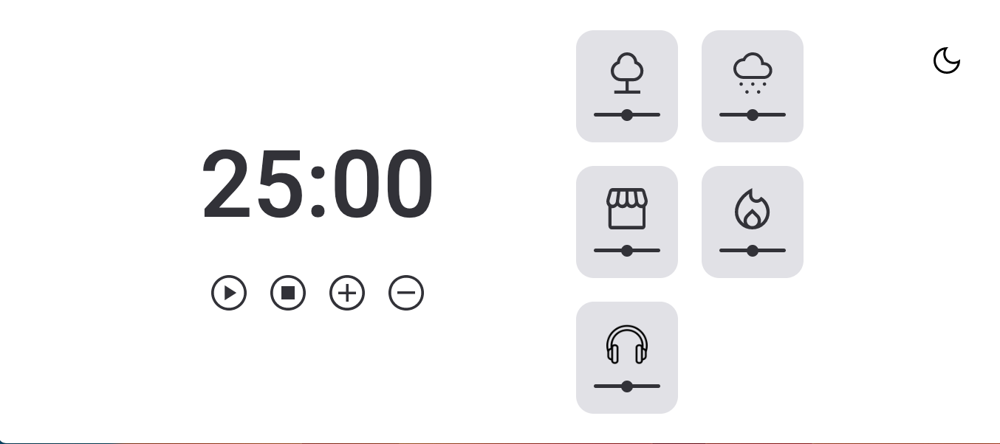

<table align="right">
  <tr>
    <td>
      <a href="README-EN.md">🇺🇸 English (only in GitHub)</a>
    </td>
  </tr>
  <tr>
    <td>
      <a href="README.md">🇧🇷 Português</a>
    </td>
  </tr>
</table>

# Focus Time

This is a pomodoro timer 🍅 application, forked by my professional colleague [Luis Machado](https://github.com/luizgmachado/FocusTime) with ambient background sound options to help you focus with the scenario you find convenient.

## 🔨 Project features

Using the combination of pomodoro and light music brings with it a series of benefits for the mind, soul and heart. When these two forms of expression come together, they create a unique synergy that amplifies the emotional impact and provides an enriching experience.

Understand the functionality of the app:

- **Play** : activates the timer;
- **Stop** : stops the timer;
- ​ **\+** : increases the timer time by another 5 minutes;
- ​ **\-** : decreases the timer time by 5 minutes.
- **Cards on the right**: when selected, it changes color and starts playing the specific sound, in addition the volume can be controlled by the slide that is under each icon.
- **Button in the upper right corner**: This is where you will switch between **Dark Mode** and **Light Mode**.

App functionality text copied from [Luis Machado](https://github.com/luizgmachado/FocusTime).

## ⚙️ Techniques and technologies used

Check out this list of everything we will use in this app:

- `HTML`
- `CSS`
- `Javascript`
- `ES6 Modules`

## 🛠️ Open and run the project

To open and run the project, run `npm i` to install the dependencies and `npm run dev` to start the project.

Then go to <a href="http://localhost:3000/">http://localhost:3000/</a> in your browser.

## 📚 More tutorial information

I was browsing Github, and I came across this project with an amazing design and cool functionality. As I like to program sometimes with a calm background and additionally like the pomodoro methodology, I found the perfect project to `forkar` by [Luis Machado](https://github.com/luizgmachado/FocusTime). However, as I'm evolving as a programmer, I thought of using this project as a test for me to edit other programmers' code, maintain and implement features. I'm creating new cards with background sounds that I find convenient, and the purpose as soon as time gaps arise, to continue implementing other types of background cards! The project figma available at this [link](<https://www.figma.com/file/XoEy9LwIv3snZntgVqXgbA/Stage-05---Dark-Mode-FocusTimer-(Copy)?node-id=0%3A1&t=D6mSRBpsFyY6dX6H -0>).

## 📝 License

> This project is under the MIT license. See the [LICENSE](.github/LICENSE.md) file for more details.

| :placard: Vitrine.Dev |                                                                  |
| --------------------- | ---------------------------------------------------------------- |
| :sparkles: Name       | **Focus Time**                                                   |
| :label: Technologies  | HTML, Javascript, CSS , ES6 Modules, GitHub ( used Technologies) |
| :rocket: URL          | https://js-app-focus-time-f6nait2yk-cristianmeelo.vercel.app/    |
| :fire: Challenge      | https://github.com/luizgmachado/FocusTime                        |
